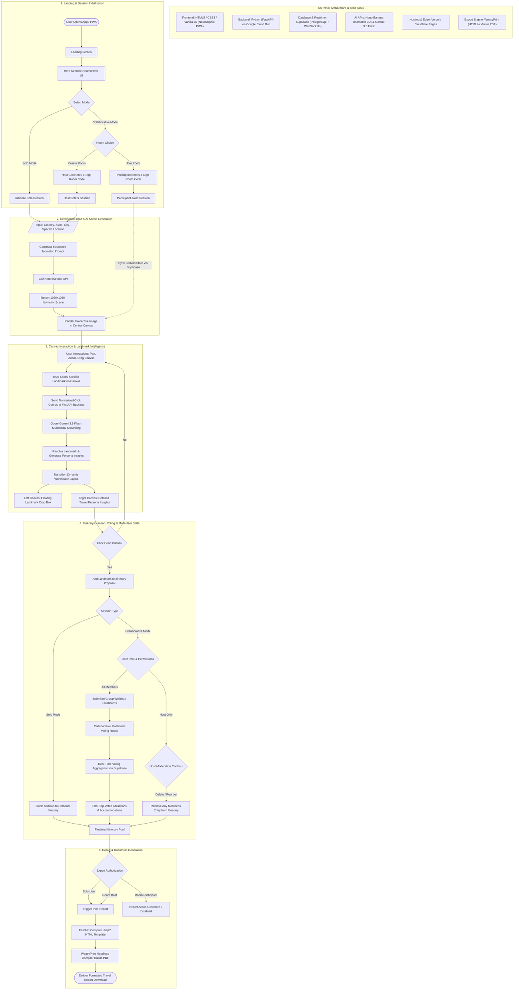

# AniTravel

## System Architecture

```mermaid
flowchart TD
    subgraph Stack["AniTravel Architecture & Tech Stack"]
        direction TB
        T1["Frontend: HTML5 / CSS3 / Vanilla JS (Neumorphic PWA)"]
        T2["Backend: Python (FastAPI) on Google Cloud Run"]
        T3["Database & Realtime: Supabase (PostgreSQL + WebSockets)"]
        T4["AI APIs: Nano Banana (Isometric 3D) & Gemini 3.5 Flash"]
        T5["Hosting & Edge: Vercel / Cloudflare Pages"]
        T6["Export Engine: WeasyPrint (HTML to Vector PDF)"]
    end

    subgraph S1["1. Landing & Session Initialization"]
        A([User Opens App / PWA]) --> B[Loading Screen]
        B --> C[Hero Section: Neumorphic UI]
        C --> D{Select Mode}
        D -->|Solo Mode| E[Initialize Solo Session]
        D -->|Collaborative Mode| F{Room Choice}
        F -->|Create Room| G[Host Generates 4-Digit Room Code]
        G --> H[Host Enters Session]
        F -->|Join Room| I[Participant Enters 4-Digit Room Code]
        I --> J[Participant Joins Session]
    end

    subgraph S2["2. Destination Input & AI Scene Generation"]
        E --> K[/Input: Country, State, City, Specific Location/]
        H --> K
        K --> L[Construct Structured Isometric Prompt]
        L --> M[Call Nano Banana API]
        M --> N[Return 1920x1080 Isometric Scene]
        N --> O[Render Interactive Image in Central Canvas]
        J -.->|Sync Canvas State via Supabase| O
    end

    subgraph S3["3. Canvas Interaction & Landmark Intelligence"]
        O --> P[User Interactions: Pan, Zoom, Drag Canvas]
        P --> Q[User Clicks Specific Landmark on Canvas]
        Q --> R[Send Normalized Click Coords to FastAPI Backend]
        R --> S[Query Gemini 3.5 Flash Multimodal Grounding]
        S --> T[Resolve Landmark & Generate Persona Insights]
        T --> U[Transition Dynamic Workspace Layout]
        U --> U1[Left Canvas: Floating Landmark Crop Box]
        U --> U2[Right Canvas: Detailed Travel Persona Insights]
    end

    subgraph S4["4. Itinerary Curation, Voting & Multi-User State"]
        U2 --> V{Click Heart Button?}
        V -->|No| P
        V -->|Yes| W[Add Landmark to Itinerary Proposal]
        W --> X{Session Type}
        
        X -->|Solo Mode| Y[Direct Addition to Personal Itinerary]
        
        X -->|Collaborative Mode| Z{User Role & Permissions}
        Z -->|All Members| AA[Submit to Group Wishlist / Flashcards]
        AA --> AB[Collaborative Flashcard Voting Round]
        AB --> AC[Real-Time Voting Aggregation via Supabase]
        AC --> AD[Filter Top-Voted Attractions & Accommodations]
        
        Z -->|Host Only| AE{Host Moderation Controls}
        AE -->|Delete / Reorder| AF[Remove Any Member's Entry from Itinerary]
        
        Y --> AG[Finalized Itinerary Pool]
        AD --> AG
        AF --> AG
    end

    subgraph S5["5. Export & Document Generation"]
        AG --> AH{Export Authorization}
        AH -->|Solo User| AI[Trigger PDF Export]
        AH -->|Room Host| AI
        AH -->|Room Participant| AJ[Export Action Restricted / Disabled]
        
        AI --> AK[FastAPI Compiles Jinja2 HTML Template]
        AK --> AL[WeasyPrint Headless Compiler Builds PDF]
        AL --> AM([Deliver Formatted Travel Report Download])
    end

```

---
